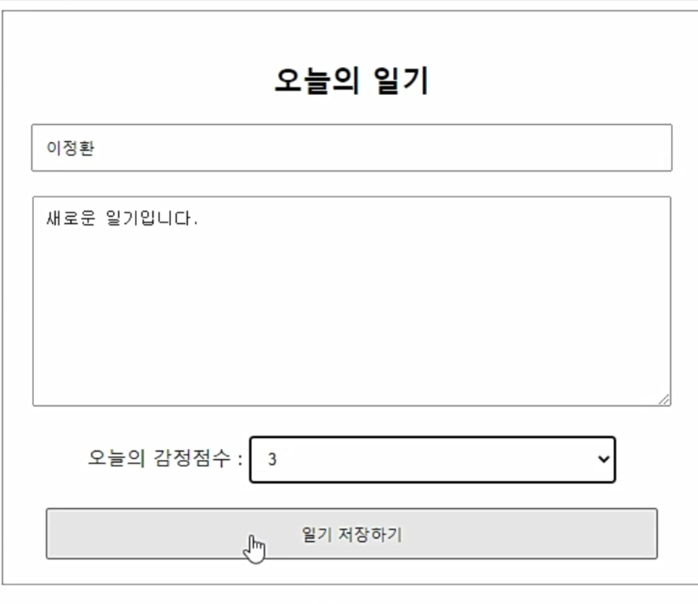
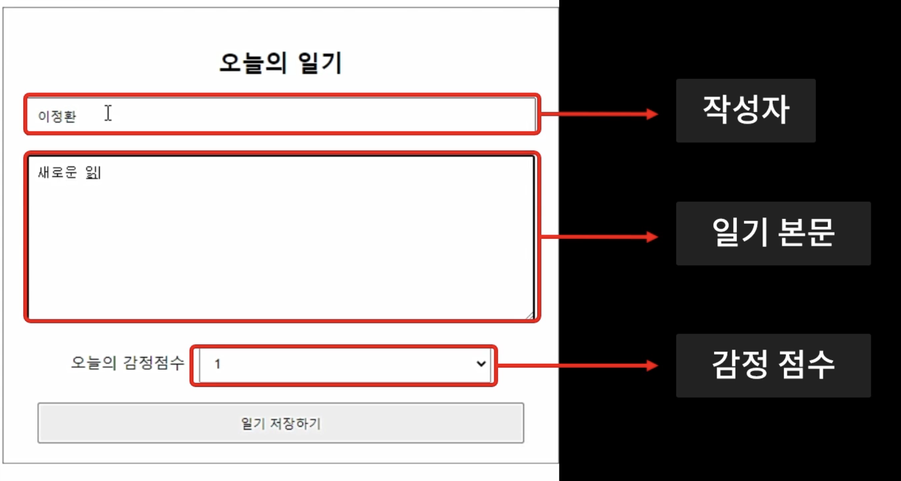
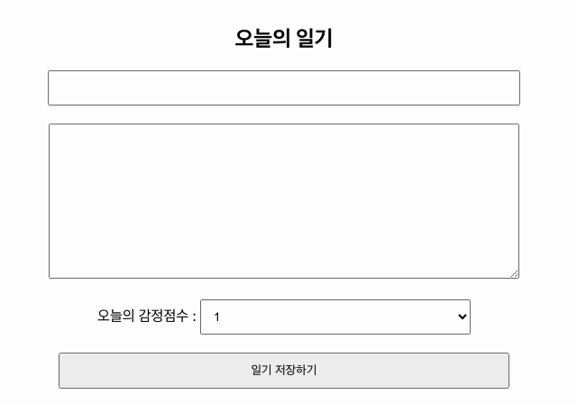
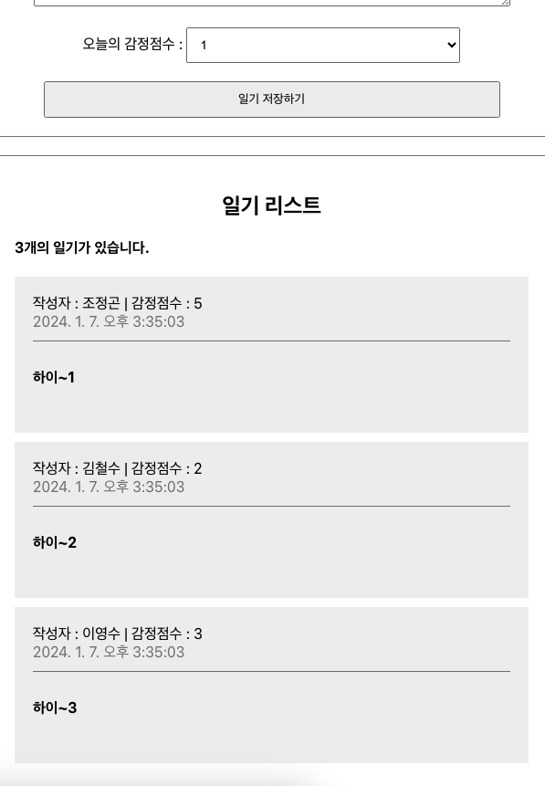
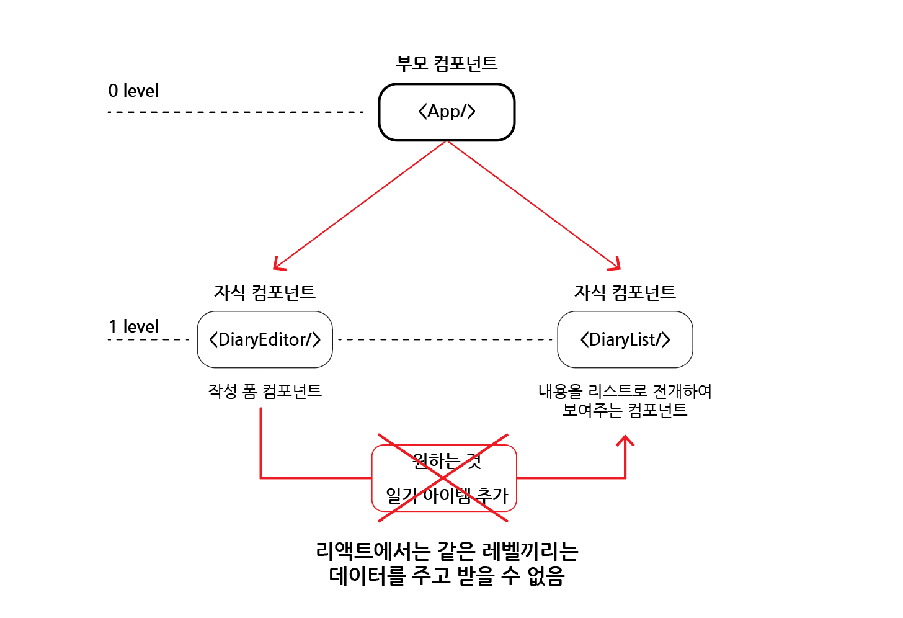
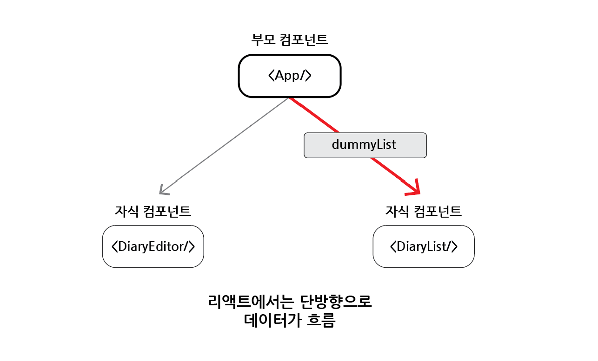
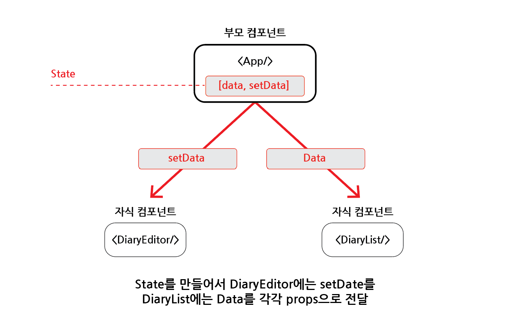
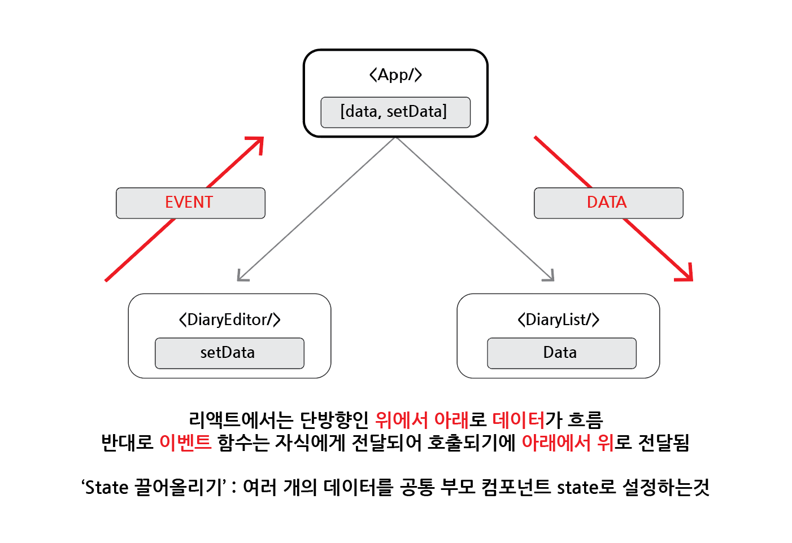
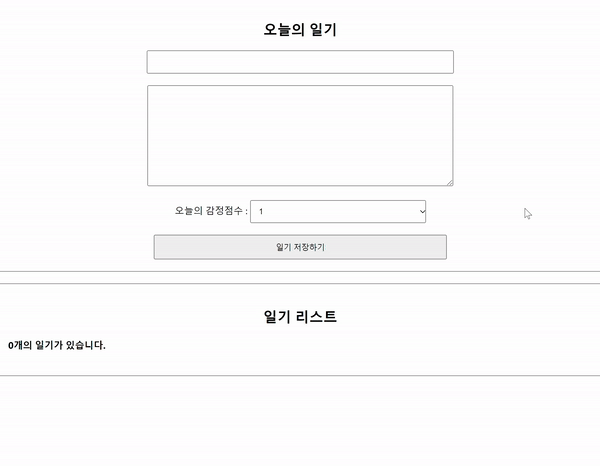

# 일기장

## 목차

-   [학습내용](#학습내용)
-   [React에서 사용자 입력 처리 - useState](#1-react에서-사용자-입력-처리---usestate)
-   [React에서 DOM 조작하기 - useRef](#2-react에서-dom-조작하기---useref)
-   [React에서 리스트 사용하기1 - 리스트 렌더링(조회)](#3-react에서-리스트-사용하기1---리스트-렌더링조회)
-   [React에서 리스트 사용하기2 - 데이터 추가](#4-react에서-리스트-사용하기2---데이터-추가)

<br>
<br>

## 학습내용

-   사용자 입력 및 배열 리스트 처리하기
-   React Lifecycle과 API
-   React App 프로처럼 성능 최적화하기 with 도구 사용
-   React 컴포넌트 트리에 전역 데이터 공급하기

<br>
<br>

## 1. React에서 사용자 입력 처리 - useState

### 1-1. 사전 준비

-   `npx create-react-app emotional_diary` 입력으로 프로젝트 생성
-   프로젝트 폴더의 컨텐츠들을 한 단계 상위 폴더로 이동시키고 기존 생성 폴더 삭제
-   잘 사용되지 않는 파일들 정리 (logo.svg, App.test.js, reactWebVitals.js, setupTest.js)

<br>

### 1-2. 목표



-   `DiaryEditor`라는 컴포넌트 만들기
    -   한 줄 입력 처리하기 (input)
    -   여러 줄 입력 처리하기 (textarea)
    -   선택 박스 입력 처리하기 (select)
    -   사용자 입력 데이터 핸들링하기

<br>

### 1-3. DiaryEditor 컴포넌트가 필요한 것



-   작성자
-   일기 본문
-   감정 점수

<br>

### 1-4. 작성자 및 일기 본문 입력받기

### - 작성자 입력받기

-   useState(상태)와 input 태그 활용

```jsx
// 작성자 입력받는 코드

import { useState } from "react";

const [author, setAuthor] = useState("");

<div>
    <input
        value={author}
        onChange={(e) => {
            setAuthor(e.target.value);
        }}
    />
</div>;
```

-   input 태그의 값을 useState의 author로 설정
-   onChange 속성을 통해 값이 바뀔 때마다 이벤트가 발생
-   이벤트 발생 시, 콜백함수를 수행하고 매개변수로 이벤트 객체 e를 보냄
-   함수 내부에서 상태 변화 함수 setAuthor가 이벤트 타겟 값(e.target.value)를 받아 author로 보냄
-   바뀐 author 값이 다시 input 태그의 value로 들어가서 화면에 렌더링됨

<br>

### - 일기 본문 입력 받기

-   앞선 작성자 입력받기와 동일
-   input 태그 대신 textarea 태그 활용

```jsx
// 일기 본문 입력받는 코드

import { useState } from "react";

const [content, setContent] = useState("");

<div>
    <textarea
        value={content}
        onChange={(e) => {
            setContent(e.target.value);
        }}
    />
</div>;
```

-   작성자 입력과 일기 본문 입력 모두 문자열 상태 값을 가짐
-   onChange 속성을 이용
-   상태 변화 함수에 e.target.value를 전달

<br>

### - 비슷한 동작의 State 묶기

-   위의 작성자 입력, 일기 본문 입력과 같이 유사하게 동작하는 State는 따로 두지 않고 하나의 State로 묶어 줄 수 있음

```jsx
// State 묶기

import { useState } from "react";

const [state, setState] = useState({
    author: "",
    content: "",
});

<div>
    <div>
        <input
            name="author"
            value={state.author}
            onChange={(e) => {
                setState({
                    ...state,
                    author: e.target.value,
                    // content: state.content,
                });
            }}
        />
    </div>
    <div>
        <textarea
            value={state.content}
            onChange={(e) => {
                setState({
                    ...state,
                    // author: state.author,
                    content: e.target.value,
                });
            }}
        />
    </div>
</div>;
```

-   초기에 author의 값 공백(""), content도 공백("")임
-   이후 값이 변화하면 변화하는 값은 e.target.value로 이벤트를 통해 변화한 값을 상태 변화 함수에 전달
-   같이 묶여있지만 값이 변화하지 않은 값은 state.(원래 값)으로 함께 객체로 전달
-   하지만 더 많은 객체가 하나의 State에 묶여있을 경우, 상태 변화 함수로 전달하는 객체가 길어질 수 있음
-   따라서 Spread 연산자(...)를 활용하여 바뀌는 값 외에는 ...state로 처리할 수 있음
    -   주의사항 : 기존의 객체(...state)를 앞에 서술해야 함
    -   뒤에 서술할 경우, 업데이트 순서가 바뀌기에 잘못된 결과 발생

<br>

### - onChange 속성 합치기

```jsx
// onChange 속성의 콜백함수 묶어내기

const handleChangeState = (e) => {
    setState({
        ...state,
        [e.target.name]: e.target.value,
    });
};

<div>
    <div>
        <input name="author" value={state.author} onChange={handleChangeState} />
    </div>
    <div>
        <textarea name="content" value={state.content} onChange={handleChangeState} />
    </div>
</div>;
```

-   '[e.target.name]: e.target.value'를 통해 이벤트가 발생하는 태그를 구분함

<br>

### 1-5. 감정 점수 선택

-   useState와 select 태그(+ option 태그)를 활용
-   앞선 input과 textarea의 속성과 똑같이 적용됨

```jsx
// 선택 입력

const [state, setState] = useState({
    author: "",
    content: "",
    emotion: 1,
});

const handleChangeState = (e) => {
    setState({
        ...state,
        [e.target.name]: e.target.value,
    });
};

<div>
    <select name="emotion" value={state.emotion} onChange={handleChangeState}>
        <option value={1}>1</option>
        <option value={2}>2</option>
        <option value={3}>3</option>
        <option value={4}>4</option>
        <option value={5}>5</option>
    </select>
</div>;
```

<br>

### 1-6. 저장 버튼

```jsx
// DiaryEditor.js

const handleSubmit = () => {
    console.log(state);
    alert("저장 성공");
};

<div>
    <button onClick={handleSubmit}>일기 저장하기</button>
</div>;
```

-   버튼 클릭 시, 클릭했기 때문에 button의 onClick 속성의 handleSubmit 함수가 실행
-   콘솔로 현재 작성된 state 객체를 출력
-   alert 메서드로 저장 성공 알림 띄우기

<br>
<br>

## 2. React에서 DOM 조작하기 - useRef

### 2-1. 목표

-   리액트에서 DOM 조작하기
    -   일기 저장 버튼 클릭 시, 작성자와 일기가 정상적으로 입력되었는지 확인
    -   정상적인 입력 아니라면 focus하기

<br>

### 2-2. 정상적인 입력이 아닐 경우, alert 띄우기

-   handleSubmit 수정하기
-   조건문으로 작성자와 본문내용의 길이에 따라 alert 띄우기
-   alert 실행 후, 이후 코드를 실행하지 않도록 return 추가

```jsx
// DiaryEditor.js

const handleSubmit = () => {
    if (state.author.length < 1) {
        alert("작성자는 최소 1글자 이상 입력해주세요");
        return;
    }

    if (state.content.length < 5) {
        alert("일기 본문은 최소 5글자 이상 입력해주세요");
        return;
    }

    alert("저장 성공");
};
```

-   하지만, 입력이 정상이 아니더라도 `alert`를 띄우는 것은 `UX 경험적으로 좋지 않음`

<br>

### 2-3. 정상적인 입력이 아닐 경우, focus 주기

-   `useRef` 사용

```jsx
// useRef import 해오기
import {useRef, useState} from "react";

// useRef 사용하여 DOM 요소 접근 가능한 기능 부여
const authorInput = useRef();
const contentInput = useRef();


// 조건문에 따라 불만족 시, 해당 현재요소에 focus하기
const handleSubmit = () => {
  if (state.author.length < 1) {
    authorInput.current.focus();
    return;
  }

  if (state.content.length < 5) {
    contentInput.current.focus();
    return;
  }

  alert("저장 성공");
};


<div>
  <input
    // ref 속성으로 DOM 연결
    ref={authorInput}
    name="author"
    value={state.author}
    onChange={handleChangeState}
  />
</div>
<div>
  <textarea
    // ref 속성으로 DOM 연결
    ref={contentInput}
    name="content"
    value={state.content}
    onChange={handleChangeState}
  />
</div>
```

-   useRef()를 지정하면 해당 변수는 `mutableRefObject`가 됨
-   mutableRefObject : HTML DOM 요소에 접근할 수 있는 기능

<br>



<리액트 DOM 조작 결과>

<br>
<br>

## 3. React에서 리스트 사용하기1 - 리스트 렌더링(조회)

### 3-1. 목표

-   `DiaryList` 컴포넌트 만들기
    -   `배열`을 이용하여 list 렌더링 해보기
    -   개별적인 컴포넌트 만들어보기

<br>

### 3-2. 더미데이터 만들고 리스트 컴포넌트에 props로 보내기

```jsx
// App.js

const dummyList = [
    {
        id: 1,
        author: "조정곤",
        content: "하이~1",
        emotion: 5,
        created_date: new Date().getTime(),
    },
    {
        id: 2,
        author: "김철수",
        content: "하이~2",
        emotion: 2,
        created_date: new Date().getTime(),
    },
    {
        id: 3,
        author: "이영수",
        content: "하이~3",
        emotion: 3,
        created_date: new Date().getTime(),
    },
];

<div className="App">
    <DiaryEditor />
    <DiaryList diaryList={dummyList} />
</div>;
```

-   `dummyList 배열`에 데이터(id, 작성자, 내용, 감정점수, 생성시간)를 `객체타입`으로 담아 만들기
-   `DiaryList` 컴포넌트에 diaryList 속성으로 dummyList 배열 props로 보내기

<br>

```jsx
// DiaryList.js

const DiaryList = ({ diaryList }) => {
    return (
        <div className="DiaryList">
            <h2>일기 리스트</h2>
            <h4>{diaryList.length}개의 일기가 있습니다.</h4>
            <div>
                {diaryList.map((it, idx) => (
                    <div key={it.id}>
                        <div>작성자 : {it.author}</div>
                        <div>일기 : {it.content}</div>
                        <div>감정 : {it.emotion}</div>
                        <div>작성 시간(ms) : {it.created_date}</div>
                    </div>
                ))}
            </div>
        </div>
    );
};

DiaryList.defaultProps = {
    diaryList: [],
};

export default DiaryList;
```

-   DiaryList 컴포넌트에서 diaryList를 props로 받기
-   `map 메서드`를 사용하여 배열 생성
-   map 메서드의 콜백함수로 배열 순회하여 객체 데이터 각각의 <div> 태그를 생성하고 최상위 <div> 태그에 담기
-   이 경우, 생성된 배열 간에 키가 지정되어있지 않아 콘솔 에러가 발생
-   따라서 최상위 <div> 요소에 `key 속성`에 각각의 배열을 구분할 수 있는 `id`를 넣어 에러 해결
    -   콜백함수의 `두 번째 인자인 인덱스(idx)`를 받아 id 대신 key 속성에 넣어 사용할 수 있음
    -   하지만 추후 순서가 변경될 경우, 수정 및 삭제의 동작 시 문제가 발생할 수 있어 id가 객체에 있다면 id를 사용하는 것을 지향함
-   map 메서드 안의 요소는 계속 반복되는 요소로 독립적인 컴포넌트로 관리할 수 있음

<br>

### 3-3. 리스트의 아이템을 관리할 컴포넌트 생성

```jsx
// DiaryList.js

import DiaryItem from "./DiaryItem";

const DiaryList = ({ diaryList }) => {
    return (
        <div className="DiaryList">
            <h2>일기 리스트</h2>
            <h4>{diaryList.length}개의 일기가 있습니다.</h4>
            <div>
                {diaryList.map((it, idx) => (
                    <DiaryItem key={it.id} {...it} />
                ))}
            </div>
        </div>
    );
};
```

-   DiaryItem 컴포넌트를 받아 콜백함수에서 사용
-   동일하게 `key 속성`으로 `id 값`을 사용하고, 나머지 데이터를 `Spread 연산자(...)`를 사용하여 `props`로 보내기

<br>

```jsx
// DiaryItem.js

const DiaryItem = ({ author, content, created_date, emotion, id }) => {
    return (
        <div className="DiaryItem">
            <div className="info">
                <span>
                    작성자 : {author} | 감정점수 : {emotion}
                </span>
                <br />
                <span className="date">{new Date(created_date).toLocaleString()}</span>
            </div>
            <div className="content">{content}</div>
        </div>
    );
};

export default DiaryItem;
```

-   `DiaryItem` 컴포넌트 생성
-   props로 받은 데이터를 요소에 담아 출력

<br>



<리스트 데이터 렌더링 예시 결과>

<br>
<br>

## 4. React에서 리스트 사용하기2 - 데이터 추가

### 4-1. 학습목표

- 배열을 이용한 React의 List에 아이템을 동적으로 추가해보기

<br>

### 4-2. 컴포넌트 & 데이터 구조 생각해보기



- DiaryEditor 컴포넌트에서 작성된 일기 내용을 DiaryList 컴포넌트에서 렌더링을 하길 원함
- 하지만, 리액트에서는 `동등한 레벨`에선 `데이터 전달이 불가능`

<br>



- 리액트는 `단방향`으로 `데이터`가 흐르는 특성을 지님

<br>



- 이를 해결하기 위해 부모인 `App 컴포넌트`에 `[data, setData]의 State`를 만듦
- `DiaryEditor` 컴포넌트에는 상태 함수인 `setData`를, `DiaryList` 컴포넌트에는 업데이트되는 `data`를 `props`로 각각 전달

<br>


- 이렇게 되면 일기가 작성될 때, DiaryEditor는 상태 함수인 setData를 호출
- 새롭게 작성된 일기 데이터는 state의 data로 전달됨
- 이 업데이트 된 data를 DiaryList에서 받아 리렌더링하게 됨

<br>



- 즉, `데이터`는 부모에서 자식, 즉, `위에서 아래`로 전달
- 자식에서는 부모로 상태 함수를 호출하기에 `이벤트`는 `아래에서 위`로 전달

<br>

### 4-3. State 만들기

### - App 컴포넌트 state 생성

```jsx
// App.js

const [data, setData] = useState([]);

const dataId = useRef(0);

const onCreate = (author, content, emotion) => {
    const created_date = new Date().getTime();
    const newItem = {
        author,
        content,
        emotion,
        created_date,
        id: dataId.current,
    };
    dataId.current += 1;
    setData([newItem, ...data]);
};
```

- 이벤트 onCreate 생성
- useRef()에 초기값으로 0 지정 => <변수명>.current로 값을 확인 할 수 있음
- 이 후 <변수명>.current를 1씩 증가시켜 id를 1씩 증가시킴
- 새로 작성된 일기내용을 기존 내용들의 앞에 위치시킴

<br>

### - props로 이벤트와 데이터 전달

```jsx
// App.js

<div className="App">
    <DiaryEditor onCreate={onCreate} />
    <DiaryList diaryList={data} />
</div>
```

- DiaryEditor로 onCreate 함수 전달
- DiaryList로 data 전달

<br>

### - 이벤트 받기

```jsx
// DiaryEditor.js

const DiaryEditor = ({ onCreate }) => {...}
```

- props로 전달된 onCreate 받기

<br>

### - 일기를 제출하면 이벤트 호출

```jsx
// DiaryEditor.js

const handleSubmit = () => {
    if (state.author.length < 1) {
        authorInput.current.focus();
        return;
    }

    if (state.content.length < 5) {
        contentInput.current.focus();
        return;
    }
    onCreate(state.author, state.content, state.emotion);
    alert("저장 성공");
    setState({
        author: "",
        content: "",
        emotion: 1,
    });
};
```

- 제출 시(handleSubmit), onCreate()함수를 호출함
- 인자로 state의 author, content, emotion을 전달
- 저장 후, 입력 칸 비우고, 감정 1로 초기화

<br>



<state를 활용한 리스트 데이터 렌더링 예시 결과>