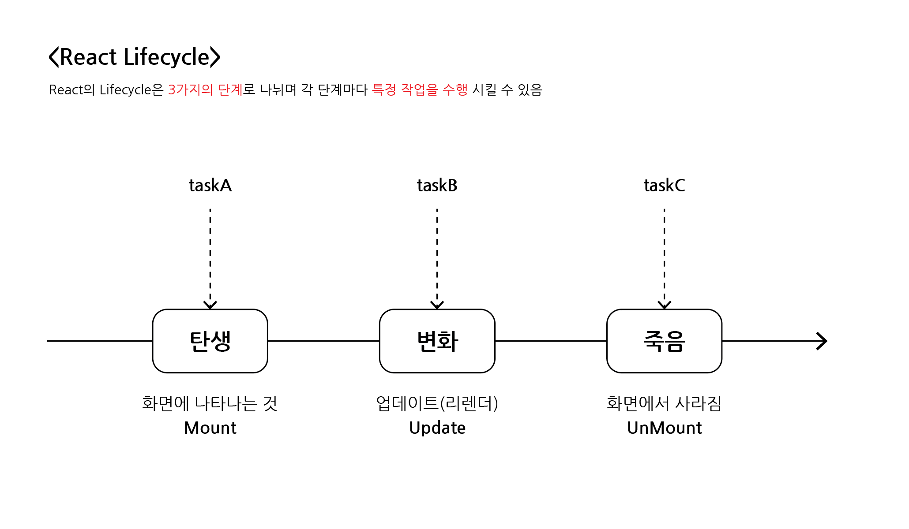

# 일기장

## 목차

1.   [React에서 사용자 입력 처리 - useState](#1-react에서-사용자-입력-처리---usestate)
2.   [React에서 DOM 조작하기 - useRef](#2-react에서-dom-조작하기---useref)
3.   [React에서 리스트 사용하기1 - 리스트 렌더링(조회)](#3-react에서-리스트-사용하기1---리스트-렌더링조회)
4.   [React에서 리스트 사용하기2 - 데이터 추가](#4-react에서-리스트-사용하기2---데이터-추가)
5.   [React에서 리스트 사용하기3 - 데이터 삭제](#5-react에서-리스트-사용하기3---데이터-삭제)
6.   [React에서 리스트 사용하기4 - 데이터 수정](#6-react에서-리스트-사용하기4---데이터-수정)
7.   [React Lifecycle 제어하기 - useEffect](#7-react-lifecycle-제어하기---useeffect)

<br>
<br>

## 학습내용

-   사용자 입력 및 배열 리스트 처리하기
-   React Lifecycle과 API
-   React App 프로처럼 성능 최적화하기 with 도구 사용
-   React 컴포넌트 트리에 전역 데이터 공급하기

<br>
<br>

## 1. React에서 사용자 입력 처리 - useState

### 1-1. 사전 준비

-   `npx create-react-app emotional_diary` 입력으로 프로젝트 생성
-   프로젝트 폴더의 컨텐츠들을 한 단계 상위 폴더로 이동시키고 기존 생성 폴더 삭제
-   잘 사용되지 않는 파일들 정리 (logo.svg, App.test.js, reactWebVitals.js, setupTest.js)

<br>

### 1-2. 목표


-   `DiaryEditor`라는 컴포넌트 만들기
    -   한 줄 입력 처리하기 (input)
    -   여러 줄 입력 처리하기 (textarea)
    -   선택 박스 입력 처리하기 (select)
    -   사용자 입력 데이터 핸들링하기

<br>

### 1-3. DiaryEditor 컴포넌트가 필요한 것


-   작성자
-   일기 본문
-   감정 점수

<br>

### 1-4. 작성자 및 일기 본문 입력받기

### - 작성자 입력받기

-   useState(상태)와 input 태그 활용

```jsx
// 작성자 입력받는 코드

import { useState } from "react";

const [author, setAuthor] = useState("");

<div>
    <input
        value={author}
        onChange={(e) => {
            setAuthor(e.target.value);
        }}
    />
</div>;
```

-   input 태그의 값을 useState의 author로 설정
-   onChange 속성을 통해 값이 바뀔 때마다 이벤트가 발생
-   이벤트 발생 시, 콜백함수를 수행하고 매개변수로 이벤트 객체 e를 보냄
-   함수 내부에서 상태 변화 함수 setAuthor가 이벤트 타겟 값(e.target.value)를 받아 author로 보냄
-   바뀐 author 값이 다시 input 태그의 value로 들어가서 화면에 렌더링됨

<br>

### - 일기 본문 입력 받기

-   앞선 작성자 입력받기와 동일
-   input 태그 대신 textarea 태그 활용

```jsx
// 일기 본문 입력받는 코드

import { useState } from "react";

const [content, setContent] = useState("");

<div>
    <textarea
        value={content}
        onChange={(e) => {
            setContent(e.target.value);
        }}
    />
</div>;
```

-   작성자 입력과 일기 본문 입력 모두 문자열 상태 값을 가짐
-   onChange 속성을 이용
-   상태 변화 함수에 e.target.value를 전달

<br>

### - 비슷한 동작의 State 묶기

-   위의 작성자 입력, 일기 본문 입력과 같이 유사하게 동작하는 State는 따로 두지 않고 하나의 State로 묶어 줄 수 있음

```jsx
// State 묶기

import { useState } from "react";

const [state, setState] = useState({
    author: "",
    content: "",
});

<div>
    <div>
        <input
            name="author"
            value={state.author}
            onChange={(e) => {
                setState({
                    ...state,
                    author: e.target.value,
                    // content: state.content,
                });
            }}
        />
    </div>
    <div>
        <textarea
            value={state.content}
            onChange={(e) => {
                setState({
                    ...state,
                    // author: state.author,
                    content: e.target.value,
                });
            }}
        />
    </div>
</div>;
```

-   초기에 author의 값 공백(""), content도 공백("")임
-   이후 값이 변화하면 변화하는 값은 e.target.value로 이벤트를 통해 변화한 값을 상태 변화 함수에 전달
-   같이 묶여있지만 값이 변화하지 않은 값은 state.(원래 값)으로 함께 객체로 전달
-   하지만 더 많은 객체가 하나의 State에 묶여있을 경우, 상태 변화 함수로 전달하는 객체가 길어질 수 있음
-   따라서 Spread 연산자(...)를 활용하여 바뀌는 값 외에는 ...state로 처리할 수 있음
    -   주의사항 : 기존의 객체(...state)를 앞에 서술해야 함
    -   뒤에 서술할 경우, 업데이트 순서가 바뀌기에 잘못된 결과 발생

<br>

### - onChange 속성 합치기

```jsx
// onChange 속성의 콜백함수 묶어내기

const handleChangeState = (e) => {
    setState({
        ...state,
        [e.target.name]: e.target.value,
    });
};

<div>
    <div>
        <input name="author" value={state.author} onChange={handleChangeState} />
    </div>
    <div>
        <textarea name="content" value={state.content} onChange={handleChangeState} />
    </div>
</div>;
```

-   '[e.target.name]: e.target.value'를 통해 이벤트가 발생하는 태그를 구분함

<br>

### 1-5. 감정 점수 선택

-   useState와 select 태그(+ option 태그)를 활용
-   앞선 input과 textarea의 속성과 똑같이 적용됨

```jsx
// 선택 입력

const [state, setState] = useState({
    author: "",
    content: "",
    emotion: 1,
});

const handleChangeState = (e) => {
    setState({
        ...state,
        [e.target.name]: e.target.value,
    });
};

<div>
    <select name="emotion" value={state.emotion} onChange={handleChangeState}>
        <option value={1}>1</option>
        <option value={2}>2</option>
        <option value={3}>3</option>
        <option value={4}>4</option>
        <option value={5}>5</option>
    </select>
</div>;
```

<br>

### 1-6. 저장 버튼

```jsx
// DiaryEditor.js

const handleSubmit = () => {
    console.log(state);
    alert("저장 성공");
};

<div>
    <button onClick={handleSubmit}>일기 저장하기</button>
</div>;
```

-   버튼 클릭 시, 클릭했기 때문에 button의 onClick 속성의 handleSubmit 함수가 실행
-   콘솔로 현재 작성된 state 객체를 출력
-   alert 메서드로 저장 성공 알림 띄우기

<br>
<br>

## 2. React에서 DOM 조작하기 - useRef

### 2-1. 목표

-   리액트에서 DOM 조작하기
    -   일기 저장 버튼 클릭 시, 작성자와 일기가 정상적으로 입력되었는지 확인
    -   정상적인 입력 아니라면 focus하기

<br>

### 2-2. 정상적인 입력이 아닐 경우, alert 띄우기

-   handleSubmit 수정하기
-   조건문으로 작성자와 본문내용의 길이에 따라 alert 띄우기
-   alert 실행 후, 이후 코드를 실행하지 않도록 return 추가

```jsx
// DiaryEditor.js

const handleSubmit = () => {
    if (state.author.length < 1) {
        alert("작성자는 최소 1글자 이상 입력해주세요");
        return;
    }

    if (state.content.length < 5) {
        alert("일기 본문은 최소 5글자 이상 입력해주세요");
        return;
    }

    alert("저장 성공");
};
```

-   하지만, 입력이 정상이 아니더라도 `alert`를 띄우는 것은 `UX 경험적으로 좋지 않음`

<br>

### 2-3. 정상적인 입력이 아닐 경우, focus 주기

-   `useRef` 사용

```jsx
// useRef import 해오기
import {useRef, useState} from "react";

// useRef 사용하여 DOM 요소 접근 가능한 기능 부여
const authorInput = useRef();
const contentInput = useRef();


// 조건문에 따라 불만족 시, 해당 현재요소에 focus하기
const handleSubmit = () => {
  if (state.author.length < 1) {
    authorInput.current.focus();
    return;
  }

  if (state.content.length < 5) {
    contentInput.current.focus();
    return;
  }

  alert("저장 성공");
};


<div>
  <input
    // ref 속성으로 DOM 연결
    ref={authorInput}
    name="author"
    value={state.author}
    onChange={handleChangeState}
  />
</div>
<div>
  <textarea
    // ref 속성으로 DOM 연결
    ref={contentInput}
    name="content"
    value={state.content}
    onChange={handleChangeState}
  />
</div>
```

-   useRef()를 지정하면 해당 변수는 `mutableRefObject`가 됨
-   mutableRefObject : HTML DOM 요소에 접근할 수 있는 기능

<br>


<리액트 DOM 조작 결과>

<br>
<br>

## 3. React에서 리스트 사용하기1 - 리스트 렌더링(조회)

### 3-1. 목표

-   `DiaryList` 컴포넌트 만들기
    -   `배열`을 이용하여 list 렌더링 해보기
    -   개별적인 컴포넌트 만들어보기

<br>

### 3-2. 더미데이터 만들고 리스트 컴포넌트에 props로 보내기

```jsx
// App.js

const dummyList = [
    {
        id: 1,
        author: "조정곤",
        content: "하이~1",
        emotion: 5,
        created_date: new Date().getTime(),
    },
    {
        id: 2,
        author: "김철수",
        content: "하이~2",
        emotion: 2,
        created_date: new Date().getTime(),
    },
    {
        id: 3,
        author: "이영수",
        content: "하이~3",
        emotion: 3,
        created_date: new Date().getTime(),
    },
];

<div className="App">
    <DiaryEditor />
    <DiaryList diaryList={dummyList} />
</div>;
```

-   `dummyList 배열`에 데이터(id, 작성자, 내용, 감정점수, 생성시간)를 `객체타입`으로 담아 만들기
-   `DiaryList` 컴포넌트에 diaryList 속성으로 dummyList 배열 props로 보내기

<br>

```jsx
// DiaryList.js

const DiaryList = ({ diaryList }) => {
    return (
        <div className="DiaryList">
            <h2>일기 리스트</h2>
            <h4>{diaryList.length}개의 일기가 있습니다.</h4>
            <div>
                {diaryList.map((it, idx) => (
                    <div key={it.id}>
                        <div>작성자 : {it.author}</div>
                        <div>일기 : {it.content}</div>
                        <div>감정 : {it.emotion}</div>
                        <div>작성 시간(ms) : {it.created_date}</div>
                    </div>
                ))}
            </div>
        </div>
    );
};

DiaryList.defaultProps = {
    diaryList: [],
};

export default DiaryList;
```

-   DiaryList 컴포넌트에서 diaryList를 props로 받기
-   `map 메서드`를 사용하여 배열 생성
-   map 메서드의 콜백함수로 배열 순회하여 객체 데이터 각각의 <div> 태그를 생성하고 최상위 <div> 태그에 담기
-   이 경우, 생성된 배열 간에 키가 지정되어있지 않아 콘솔 에러가 발생
-   따라서 최상위 <div> 요소에 `key 속성`에 각각의 배열을 구분할 수 있는 `id`를 넣어 에러 해결
    -   콜백함수의 `두 번째 인자인 인덱스(idx)`를 받아 id 대신 key 속성에 넣어 사용할 수 있음
    -   하지만 추후 순서가 변경될 경우, 수정 및 삭제의 동작 시 문제가 발생할 수 있어 id가 객체에 있다면 id를 사용하는 것을 지향함
-   map 메서드 안의 요소는 계속 반복되는 요소로 독립적인 컴포넌트로 관리할 수 있음

<br>

### 3-3. 리스트의 아이템을 관리할 컴포넌트 생성

```jsx
// DiaryList.js

import DiaryItem from "./DiaryItem";

const DiaryList = ({ diaryList }) => {
    return (
        <div className="DiaryList">
            <h2>일기 리스트</h2>
            <h4>{diaryList.length}개의 일기가 있습니다.</h4>
            <div>
                {diaryList.map((it, idx) => (
                    <DiaryItem key={it.id} {...it} />
                ))}
            </div>
        </div>
    );
};
```

-   DiaryItem 컴포넌트를 받아 콜백함수에서 사용
-   동일하게 `key 속성`으로 `id 값`을 사용하고, 나머지 데이터를 `Spread 연산자(...)`를 사용하여 `props`로 보내기

<br>

```jsx
// DiaryItem.js

const DiaryItem = ({ author, content, created_date, emotion, id }) => {
    return (
        <div className="DiaryItem">
            <div className="info">
                <span>
                    작성자 : {author} | 감정점수 : {emotion}
                </span>
                <br />
                <span className="date">{new Date(created_date).toLocaleString()}</span>
            </div>
            <div className="content">{content}</div>
        </div>
    );
};

export default DiaryItem;
```

-   `DiaryItem` 컴포넌트 생성
-   props로 받은 데이터를 요소에 담아 출력

<br>


<리스트 데이터 렌더링 예시 결과>

<br>
<br>

## 4. React에서 리스트 사용하기2 - 데이터 추가

### 4-1. 학습목표

- 배열을 이용한 React의 List에 아이템을 동적으로 추가해보기

<br>

### 4-2. 컴포넌트 & 데이터 구조 생각해보기


- DiaryEditor 컴포넌트에서 작성된 일기 내용을 DiaryList 컴포넌트에서 렌더링을 하길 원함
- 하지만, 리액트에서는 `동등한 레벨`에선 `데이터 전달이 불가능`

<br>


- 리액트는 `단방향`으로 `데이터`가 흐르는 특성을 지님

<br>


- 이를 해결하기 위해 부모인 `App 컴포넌트`에 `[data, setData]의 State`를 만듦
- `DiaryEditor` 컴포넌트에는 상태 함수인 `setData`를, `DiaryList` 컴포넌트에는 업데이트되는 `data`를 `props`로 각각 전달

<br>


- 이렇게 되면 일기가 작성될 때, DiaryEditor는 상태 함수인 setData를 호출
- 새롭게 작성된 일기 데이터는 state의 data로 전달됨
- 이 업데이트 된 data를 DiaryList에서 받아 리렌더링하게 됨

<br>


- 즉, `데이터`는 부모에서 자식, 즉, `위에서 아래`로 전달
- 자식에서는 부모로 상태 함수를 호출하기에 `이벤트`는 `아래에서 위`로 전달

<br>

### 4-3. State 만들기

### - App 컴포넌트 state 생성

```jsx
// App.js

const [data, setData] = useState([]);

const dataId = useRef(0);

const onCreate = (author, content, emotion) => {
    const created_date = new Date().getTime();
    const newItem = {
        author,
        content,
        emotion,
        created_date,
        id: dataId.current,
    };
    dataId.current += 1;
    setData([newItem, ...data]);
};
```

- 이벤트 onCreate 생성
- useRef()에 초기값으로 0 지정 => <변수명>.current로 값을 확인 할 수 있음
- 이 후 <변수명>.current를 1씩 증가시켜 id를 1씩 증가시킴
- 새로 작성된 일기내용을 기존 내용들의 앞에 위치시킴

<br>

### - props로 이벤트와 데이터 전달

```jsx
// App.js

<div className="App">
    <DiaryEditor onCreate={onCreate} />
    <DiaryList diaryList={data} />
</div>
```

- DiaryEditor로 onCreate 함수 전달
- DiaryList로 data 전달

<br>

### - 이벤트 받기

```jsx
// DiaryEditor.js

const DiaryEditor = ({ onCreate }) => {...}
```

- props로 전달된 onCreate 받기

<br>

### - 일기를 제출하면 이벤트 호출

```jsx
// DiaryEditor.js

const handleSubmit = () => {
    if (state.author.length < 1) {
        authorInput.current.focus();
        return;
    }

    if (state.content.length < 5) {
        contentInput.current.focus();
        return;
    }
    onCreate(state.author, state.content, state.emotion);
    alert("저장 성공");
    setState({
        author: "",
        content: "",
        emotion: 1,
    });
};
```

- 제출(handleSubmit) 시, onCreate()함수를 호출함
- 인자로 state의 author, content, emotion을 전달
- 저장 후, 입력 칸 비우고, 감정 1로 초기화

<br>


<state를 활용한 리스트 데이터 렌더링 예시 결과>

<br>
<br>

## 5. React에서 리스트 사용하기3 - 데이터 삭제

### 5-1. 학습목표

- 삭제버튼을 각 일기 리스트 목록마다 생성
- 삭제버튼을 클릭할 경우, 확인 메시지가 전달되고 확인을 누르면 해당 일기 아이템이 삭제되고 리렌더링 됨

<br>

### 5-2. onDelete 함수 생성

```jsx
// App.js

// onDelete 함수
const onDelete = (targetId) => {
    console.log(`${targetId}가 삭제되었습니다`);
    const newDiaryList = data.filter((it) => it.id !== targetId);
    setData(newDiaryList);
};

return (
    <div className="App">
        <DiaryEditor onCreate={onCreate} />
        // DiaryList로 props로 onDelete 전달
        <DiaryList onDelete={onDelete} diaryList={data} />
    </div>
);
```

- onDelete 함수는 삭제버튼과 함께 해당 일기 아이템의 id값을 targetId인자로 받음
- 필터를 사용하여 data에서 id가 인자로 받은 targetId와 같지 않은 나머지 아이템들을 모음
- 새롭게 생성된 일기 리스트들을 setData() 상태 함수에 넣어 상태 바꾸기

<br>

### 5-3. DiaryList로 전달된 onDelete 함수를 DiaryItem 컴포넌트로 전달

```jsx
// DiaryList.js

const DiaryList = ({ onDelete, diaryList }) => {
    return (
        <div className="DiaryList">
            <h2>일기 리스트</h2>
            <h4>{diaryList.length}개의 일기가 있습니다.</h4>
            <div>
                {diaryList.map((it, idx) => (
                    // DiaryItem으로 onDelete 전달
                    <DiaryItem key={it.id} {...it} onDelete={onDelete} />
                ))}
            </div>
        </div>
    );
};
```

- onDelete 함수를 DiaryItem 컴포넌트로 props로 전달

<br>

### 5-4. 삭제 시, onDelete 함수 호출하고 해당 아이템의 id값 전달

```jsx
// DiaryItem.js

// onDelete 함수 전달 받음
const DiaryItem = ({
                       onDelete,
                       author,
                       content,
                       created_date,
                       emotion,
                       id,
                   }) => {
    return (
        <div className="DiaryItem">
            // ...
            <button
                onClick={() => {
                    console.log(id);
                    if (window.confirm(`${id}번째 일기를 정말 삭제하시겠습니까?`)) {
                        onDelete(id);
                    }
                }}
            >
                삭제하기
            </button>
        </div>
    );
};
```

- onClick의 콜백함수를 지정
- `window.confirm()` : 확인 메시지 띄우기
  - 확인 클릭(true)일 경우, `onDelete` 함수 호출하여 파라미터로 해당 일기 아이템의 id 전달
  - 취소 클릭(false)일 경우, 아무 일도 발생하지 않음

<br>


<리스트 데이터 삭제 예시 결과>

<br>
<br>

## 6. React에서 리스트 사용하기4 - 데이터 수정

### 6-1. 수정하기 기능에서 필요한 것

- 수정하기 버튼
- 수정하기 버튼을 누르면 기존 내용이 수정폼으로 변환
- 특정 글자 수를 충족 시, 수정 완료되고 그렇지 않을 경우, 수정폼에 포커스 되도록 하기

<br>

### 6-2. isEdit의 상태에 따른 버튼과 일기내용 변환

### - 수정하기 버튼 만들기

```jsx
// DiaryItem.js

<button onClick={handleRemove}>삭제하기</button>
<button onClick={toggleIsEdit}>수정하기</button>
```

- 기존 삭제하기 버튼과 함께 수정하기 버튼 만들기
- 수정하기 버튼 클릭 시, toggleIsEdit 함수 실행

<br>

### - state와 toggleIsEdit

```jsx
// DiaryItem.js

const [isEdit, setIsEdit] = useState(false);
const toggleIsEdit = () => setIsEdit(!isEdit);
```

- `isEdit`이란 변수를 설정하고 state로 기본 값을 `false`로 지정
- toggleIsEdit은 상태 함수 setIsEdit의 인자로 `!isEdit`을 두어 isEdit이 false면 true로, true면 false로 `반전`되도록 함(스위치)
- true는 수정상태, false는 비 수정상태
- 수정하기 버튼의 onClick에 toggleIsEdit 지정

<br>

### - 삼항 연산자를 이용한 일기내용, 수정폼, 버튼 변환

```jsx
// DiaryItem.js

const [localContent, setLocalContent] = useState(content);

...

<div className="content">
    {isEdit ? (
        <textarea
            value={localContent}
            onChange={(e) => {
                setLocalContent(e.target.value);
            }}
        />
    ) : (
        <>{content}</>
    )}
</div>

{isEdit ? (
    <>
        <button onClick={handleQuitEdit}>수정 취소</button>
        <button onClick={handleEdit}>수정 완료</button>
    </>
) : (
    <>
        <button onClick={handleRemove}>삭제하기</button>
        <button onClick={toggleIsEdit}>수정하기</button>
    </>
)}
```

- 삼항 연산자를 사용하여 isEdit이 true, 즉 수정상태이면, textarea 요소가 생김
- 수정폼 textarea의 내용은 변수 localContent로 지정하고 state를 사용하여 `초기 값`을 기존에 작성되어있던 `일기 내용인 content`로 설정
- 버튼의 경우에도 삼항 연산자를 사용하여 isEdit이 true, 즉 수정상태이면 `수정 취소`, `수정 완료` 버튼을 보여주고, false로 수정상태가 아니면 기존의 `삭제하기` 및 `수정하기` 버튼이 보이도록 함

<br>

### 6-3. 버튼의 onClick 설정 및 데이터 이벤트 함수 자식으로 전달

### - onClick 설정

```jsx
// DiaryItem.js

// textarea의 DOM 접근 할 수 있도록 localContentInput 생성
const localContentInput = useRef();

// 수정 완료 버튼 클릭 시, 실행되는 hadleEdit 함수
const handleEdit = () => {
    if (localContent.length < 5) {
        localContentInput.current.focus();
        return;
    }
    if (window.confirm(`${id}번째 일기를 수정하시겠습니까?`)) {
        onEdit(id, localContent);
        toggleIsEdit();
    }
};


// 수정 취소 버튼 클릭 시, 실행되는 handleQuitEdit 함수
const handleQuitEdit = () => {
    setIsEdit(false);
    setLocalContent(content);
};

...

// 내용 수정 폼 textarea
<textarea ref={localContentInput}... />

// 수정 취소, 수정 완료 버튼
<>
    <button onClick={handleQuitEdit}>수정 취소</button>
    <button onClick={handleEdit}>수정 완료</button>
</>
```

- 먼저 수정 취소 버튼의 `handleQuitEdit`을 보면, `setIsEdit(false);`을 통해 수정하지 않음으로 변경
- 만약, 수정 중이였다면 수정 취소를 누르고 다시 수정하기 버튼을 클릭할 경우, 앞선 수정 내역이 그대로 남아있기에 취소 시, 이를 `초기화`하기 위해 `setLocalContent(content);`으로 기존 일기내용 넣기
- 수정 완료를 클릭하면 `handleEdit` 함수가 실행 됨
- textarea에 `useRef()`인 `localContentInput` 지정하여 DOM 접근 할 수 있도록 하기
- handleEdit 함수는 기존 일기내용의 규칙처럼 5글자 미만으로 작성된 경우, `focus()` 주기
- 통과된 경우, 확인 창을 띄우고 `onEdit()` 함수에 id와 localContent를 보내 데이터 수정
- toggleIsEdit() 함수로 다시 수정 활성화 상태 닫기

<br>

### - App 컴포넌트에서 onEdit 전달하기

```jsx
// App.js

const onEdit = (targetId, newContent) => {
    setData(
        data.map((it) =>
            it.id === targetId ? { ...it, content: newContent } : it,
        ),
    );
};

...

<DiaryList onEdit={onEdit} onRemove={onRemove} diaryList={data} />
```

```jsx
// DiaryList.js

const DiaryList = ({ onEdit, onRemove, diaryList }) => {
    ...
    <DiaryItem key={it.id} {...it} onRemove={onRemove} onEdit={onEdit} />
};
```

- onEdit 함수는 데이터의 `id`와 `수정된 내용`을 전달받음
- data들을 `map`으로 순회하여 인자로 전달받은 id와 같은 데이터를 찾아 content만 수정된 newContent로 `덮어씌움`
- App 컴포넌트에서 생성된 onEdit 함수를 DiaryList 컴포넌트로 전달하고 다시 DiaryItem 컴포넌트로 전달함

<br>


<리스트 데이터 수정 예시 결과>

<br>
<br>

## 7. React Lifecycle 제어하기 - useEffect

### 7-1. Lifecycle

- 생애주기로 일반적으로 `시간의 흐름`에 따라 탄생부터 죽음까지 이르는 `단계적` 과정
- React의 컴포넌트 역시 생명주기(Lifecycle)을 가짐
- 
<br>



- React의 Lifecycle은 크게 3가지의 단계로 나뉨
    - `탄생`(Mount) : 화면에 나타나는 것
    - `변화`(Update) : 업데이트(리렌더)
    - `죽음`(Unmount) : 화면에서 사라짐
- 각각의 단계마다 `특정한 작업`을 수행하도록 할 수 있음

<br>

### - Lifecycle 각각의 단계에서 사용하는 메서드

- 지금까지는 화살표 함수를 이용한 `함수형 컴포넌트`만 이용해왔음
- 하지만, 이 메서드들은 `클래스형 컴포넌트`에서만 사용 가능 하다.
- `ref`, `state`의 경우도 함수형 컴포넌트에서는 사용이 불가능하고 `클래스형 컴포넌트`에서만 사용이 가능하다.

<br>

1. Mount 단계 : ComponentDidMount()
2. Update 단계 : ComponentDidUpdate()
3. Unmount 단계 : ComponentWillUnmount()

<br>

### 7-2. React Hooks

- 2019년 6월 정식 출시된 기능
- 앞선 Lifecycle에서 사용하는 메서드, state, ref를 함수형 컴포넌트를 사용하는 React에서 `사용하기 어려움`이 있었음
- 따라서 이러한 문제점을 해결하고자, `use` 키워드를 앞에 붙여 `클래스형 컴포넌트`가 사용하는 이 기능들을 `함수형 컴포넌트`에서 사용할 수 있도록 Hooking(낚음)한 것
- ex) useState, useEffect, useRef, ...

<br>

### - 애초에 React에서 클래스형 컴포넌트를 사용하지 않은 이유는?

- 클래스형 컴포넌트의 코드가 매우 길어질 수 있고 복잡해질 수 있음
- 중복 코드, 가독성 문제 등 여러 문제점을 해결하기 위해서 함수형 컴포넌트를 사용

<br>

### 7-3. useEffect

- 앞선 각 `Lifecycle의 단계에서 사용하는 메서드`들을 함수형 컴포넌트에서 사용할 수 있게 해줌
- 2개의 파라미터인 `콜백함수`, `의존성 배열`을 받음

```jsx
// useEffect 사용

import React, { useEffect } from "react";

useEffect(() => {
    // 콜백함수 작성
}, []); // '[]'는 Dependency Array(의존성 배열) : 이 배열 내에 들어있는 값이 변화하면 콜백함수가 수행됨
```

<br>

### - Mount 단계에서 작업수행

```jsx
// 새로 만든 Lifecycle.js

// Mount 단계에서 작업수행

import React, { useEffect, useState } from "react";

const Lifecycle = () => {
// Mount 단계에 실행됨 -> dependency array에 빈배열
    useEffect(() => {
        console.log("Mount!");
    }, []);
}
```

- dependency 배열에 아무 값도 넣지 않으면(`빈배열`) Mount 단계에서 콜백함수가 수행됨

<br>

### - Update 단계에서 작업수행

```jsx
// Lifecycle.js

import React, { useEffect, useState } from "react";

const Lifecycle = () => {
    const [count, setCount] = useState(0);
    const [text, setText] = useState("");

    // Update 단계에 실행됨 -> dependency array 없애기: 어느 요소라도 업데이트 되면 콜백함수 수행
    useEffect(() => {
      console.log("Update!");
    });
    
    // 특정 요소가 업데이트 되면 콜백함수 수행
    // count의 state가 변하는 순간 콜백함수 수행
    useEffect(() => {
      console.log(`count is update : ${count}`);
      if (count > 5) {
        alert("count가 5를 넘었습니다. 따라서 1로 초기화 합니다.");
        setCount(1);
      }
    }, [count]);
    
    // text의 state가 변하는 순간 콜백함수 수행
    useEffect(() => {
      console.log(`text is update : ${text}`);
    }, [text]);
}
```

- `dependency 배열을 자체를 없애면` 어느 요소라도 업데이트 되면 콜백함수 수행
- `dependency 배열에 값을 넣으면`, 해당 변수 값이 업데이트 되면 콜백함수 수행

<br>


<Update시 콘솔출력 예시>

<br>

### - Unmount 단계에서 작업수행

```jsx
// Lifecycle.js

import React, { useEffect, useState } from "react";

const UnmountTest = () => {
    // Unmount 단계에서 수행되는 작업을 만들기 위해서는 콜백함수 안에서
    // 함수를 리턴하게 하면, Unmount되는 경우, 리턴된 함수가 수행됨
    useEffect(() => {
        console.log("Mount!");
        return () => {
            // Unmount 경우, 수행
            console.log("Unmount!");
        };
    }, []);
    return <div>Unmount Testing Component</div>;
};
```

- Unmount 단계에서 수행되는 작업을 만들기 위해서는 useEffect의 콜백함수에 `리턴 함수를 정의`하면 해당 함수가 Unmount 단계에서 수행됨

<br>


<Mount와 Unmount시 콘솔출력 예시>